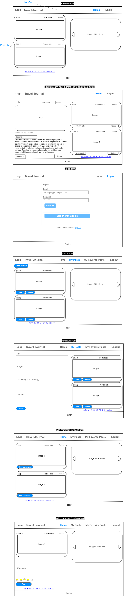
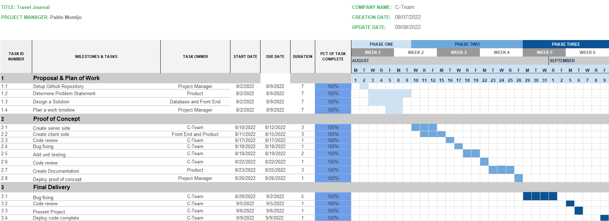

# travel-journal
Guide for travelers around the world. 

# Problem Statement (Owner: Product)
# Scope:
We travel to make us happy. Therefore, it is important for millions of travelers to be able to find an unforgettable experience without inconveniences. 

# Impact: 
Currently, travellers need to search though multiple sites to find the latest updates or travel tips. There is no "go-to" site or application for the travel community for reviewing recent user trips. If this information is lacking, travellers can find themselves in a predicament when they arrive at their destination. 

# Causes: 
When travellers are spending time fixing their travel problems, they are not spending time enjoying their trip. Consequently, the traveller will feel that they have wasted their time and money. 

# Other solutions: 
Through our application, travellers have a platform to share their experiences. Prospective travellers can then plan their trips in advance to avoid any inconveniences by using the shared content, comments, and reviews of other user's trips.

# Design a Solution (Owner: Database & Frontend)


## Overview of travel-journal website that will be built
This project is to build a blog website for travelers. It is a collection of the interesting and useful information of all favorite places where travelers have unforgettable experiences when they visited there.
Each post of any traveler will be review, comment and rating by users who are interested in the post.
More valuable posts with positive comments and rating from every user in the world are more valuable data for this website.
## Description of the Databases, Collections, Schema, Source of data
  Database name: travel-journal (in MongoDB Atlas);
  Collections: users, posts, comments
  Collection Schemas:
  1/ users {
      userid (_id): string,
      firstName: string,
      lastName: string,
      email: string,
      password: string,
      image: string,
      createdAt: timeStamp,
      updatedAt: timeStamp
    };
  2/ posts {
      postid (_id): string,
      title (title of the post): string,
      city: string,
      country: string,
      image: string,
      content (unforgettable memories): string,
      roundtripPrice {
        airBnBPrice: number,
        hotelPrice: number,
        couplePrice: number,
        familyPrice: number
      }
      userid: string,
      createdAt: timeStamp,
      updatedAt: timeStamp
    };
  3/ myFavoritePosts {
      postId (_id): string,
      userId: string,
      createdAt: timeStamp
    };

  4/ comments {
      commentid (_id): string,
      name: string,
      email: string,
      postid: string,
      text: string,
      rating (from 1 to 5 stars): number,
      date: timeStamp
    };


## List of endpoints
  registerUser;
  updateUser;
  loginUser;
  getUserById;
  getAllPosts;
  getPostsByUserId;
  getPostByPostId;
  createPost;
  updatePost;
  deletePost;
  createComment;
  getCommentsByPostId;
  getAvgRateForPost;


## External tools (not libraries like React, but separate systems or third party tools, like a second database)
For Front-End: redux-toolkit, jwt-decode, bootstrap, react-google-login, react-paginate, react-icons, axios,...

For Back-End: mongoose, express, express-async-handler, bcryptjs, dotenv, jsonwebtoken, nodemon, concurrently, multer, body-parse, cors,...

## Describe the functionality that the front end app will have
Home page: display all posts with comments and rating for each post and searching feature
Login page;
Register page;
Update user page;
My Posts: display all posts of loggedin user;
My Favorite Posts: display all the user's favorite posts


# Plan a work timeline (Owner: Project Manager)
## High level work timeline. List the work items that you plan to complete, organized by each of the 5 remaining weeks until the presentation




## Developing This API

Make sure you have version 14 or 16 of Node.js installed on your computer.
In your terminal, from inside this project directory, run npm install to install the project dependencies.
You may also need to change the directory/folder to 'frontend', and run npm install to install additional project dependencies.
Create a .env file in the root project directory with the following code: 
```
NODE_ENV = development

PORT = 5000

MONGO_URI = "mongodb+srv://<admin>:<password>@<cluster>.mongodb.net/travel_journal?retryWrites=true&w=majority"

JWT_SECRET = c-team2022
```
Run npm run dev to start the local server. You should see a logged statement telling you Server is listening on http://localhost:5000.
Use curl or API client of your choice to browse the various endpoints contained in this project. 


## Using This API
There are 16 routes available:
```
GET /comments/post/:id
POST /comments
DELETE /comments/:id

GET /favoriteposts
POST /favoriteposts
DELETE /favoriteposts/:id

GET /posts
GET /posts/post/:id
GET /posts/user
POST /posts
PUT /posts/:id
DELETE /posts/:id

GET /userModel/me
POST /userModel/login
POST /userModel/register
PUT /userModel/:id
```


## Get One Comment

Path id parameter is a hexadecimal id. Responses for failures will include a field of error.

Example good request: `curl http://localhost:5000/api/comments/post/6304549cae0ccea9638cad1e`

Example response: ```[]```

Example bad response: `{error: 'No comment found with the post id 6304549cae0ccea9638cad1e.'}`


## Create a Comment

Responses for failures will include a field of error.

Example good request: `curl -X POST -H "Content-Type: application/json" -d '{"userId":"63019debd198b257dfd0088b", "postId":"63019debd198b257dfd00ee4"}' http://localhost:5000/api/comments`

Example response: ```[]```

Example bad request: `curl -X POST -H "Content-Type: application/json" -d '{"userId":"63019debd198b257dfd0088b"}' http://localhost:5000/api/comments`

Example bad response: `{error: 'User id, post Id and comment are required.'}`

Example failure response: `{error: 'Invalid comment data'}`


## Delete a Comment

Responses for failures will include a field of error.

Example good request: `curl -X DELETE http://localhost:5000/api/comments/6304549cae0ccea9638cad1e`

Example response: ```[]```

Example failure response: `{error: 'Comment not found.'}`


## Get All Favorite Posts by a User

Responses for failures will include a field of error.

Example good request: `curl http://localhost:5000/api/comments/post/6304549cae0ccea9638cad1e`

Example response: ```[]```

Example bad response: `{error: 'No favorite found with the user id 63019debd198b257dfd0088b.'}`


## Create a Favorite Post

Responses for failures will include a field of error.

Example good request: `curl -X POST -H "Content-Type: application/json" -d '{"userId":"63019debd198b257dfd0088b", "postId":"63019debd198b257dfd00ee4"}' http://localhost:5000/api/comments`

Example response: ```[]```

Example response if post already exists with the same userId and postId: `{error: 'The post already exists in your favorite post collection.'}`

Example bad request: `curl -X POST -H "Content-Type: application/json" -d '{"userId":"63019debd198b257dfd0088b"}' http://localhost:5000/api/comments`

Example bad response: `{error: 'User id and post id are required!'}`

Example failure response: `{error: 'Invalid my favorite post data.'}`


## Delete a Favorite Post

Responses for failures will include a field of error.

Example good request: `curl -X DELETE http://localhost:5000/api/comments/6304549cae0ccea9638cad1e`

Example response: ```[]```

Example failure response: `{error: 'My favorite post not found.'}`


## Get All Posts

Responses for failures will include a field of error.

Example good request: `curl http://localhost:5000/api/posts`

Example response: ```[]```

Example bad response: `{error: "Something went wrong. Please try again."}`


## Get a Post

Responses for failures will include a field of error.

Example good request: `curl http://localhost:5000/api/posts/post/63019debd198b257dfd0088b`

Example response: ```[]```

Example bad response: `{error: 'No post found with id 63019debd198b257dfd0088b.'}`


## Get All Posts by a User

Responses for failures will include a field of error.

Example good request: `curl http://localhost:5000/api/posts/user`

Example response: ```[]```

Example bad response: `{error: 'No post found with the user id 63019debd198b257dfd0088b.'}`


## Create a Post

Responses for failures will include a field of error.

Example good request: `curl -X POST -H "Content-Type: multipart/form-data" -d '{"title":"test title", "content":"test content", "city":"Seattle","country":"USA"}' http://localhost:5000/api/posts`

Example response: ```[]```

Example bad request: `curl -X POST -H "Content-Type: multipart/form-data" -d '{"title":"test title"}' http://localhost:5000/api/posts`

Example bad response: `{error: 'Title and content are required!'}`

Example failure response: `{error: 'Invalid post data'}`


## Update a Post

Responses for failures will include a field of error.

Example good request: `curl -X PUT -H "Content-Type: multipart/form-data" -d '{"title":"test", "content":"test content", "city":"test city","country":"USA"}' http://localhost:5000/api/posts/63019debd198b257dfd0088b`

Example response: ```[]```

Example bad response if postId is not found: `{error: 'Post not found'}`

Example bad response if userId is not found: `{ error: 'User not found'}`

Example bad response if user is not authenticated: `{error: 'User not authorized'}`

Example bad response if image could not be replaced: `{error: 'Image not found!'}`

Example failure response: `{error: "Something went wrong. Please try again."}`


## Delete a Post

Responses for failures will include a field of error.

Example good request: `curl -X DELETE http://localhost:5000/api/posts/63019debd198b257dfd0088b`

Example response: ```[]```

Example bad response if postId is not found: `{error: 'Post not found'}`

Example bad response if userId is not found: `{ error: 'User not found'}`

Example bad response if user is not authenticated: `{error: 'User not authorized'}`

Example bad response if image could not be replaced/does not exist: `{error: 'Image not found!'}`


## Review User Information

Responses for failures will include a field of error.

Example good request: `curl http://localhost:5000/api/users/me`

Example response: ```[]```


## Login a User

Responses for failures will include a field of error.

Example good request: `curl -X POST -H "Content-Type: application/json" -d '{"email":"test@uw.edu", "password":"secrets!"}' http://localhost:5000/api/users/login`

Example response: ```[]```

Example bad response if email is not found: `{error: 'No user found with email test@uw.edu.'}`

Example bad response if email is found but is not associated with a password within the database: `{error: "User doesn't have password?"}`

Example bad response if password is incorrect: `{error: "Password is incorrect!"}`


## Register a User

Responses for failures will include a field of error.

Example good request: `curl -X POST -H "Content-Type: multipart/form-data" -d '{"firstName":"test", "lastName":"lo", "email":"test@uw.edu","password":"secrets!"}' http://localhost:5000/api/users/register`

Example response: ```[]```

Example bad request: `curl -X POST -H "Content-Type: multipart/form-data" -d '{"firstName":"test", "lastName":"lo"}' http://localhost:5000/api/users/register`

Example bad response: `{error: "Users must have a name, password, and email."}`

Example bad response if email already exists in database: `{error:"This email is already in use"}`

Example failure response: `{error:'Invalid user data'}`


## Update User Information

Responses for failures will include a field of error.

Example good request: `curl -X PUT -H "Content-Type: multipart/form-data" -d '{"firstName":"test", "lastName":"lo", "email":"test@uw.edu","password":"secrets!"}' http://localhost:5000/api/users/573a13a3f29313caabd0e77b`

Example response: ```[]```

Example bad response if email already exists in database: `{error: 'Email already exists.'}`

Example bad response if password is incorrect: `{error: 'Old password is incorrect!'}`

Example bad response if image fails to be replaced/does not exist: `{error: 'Image not found!'}`

Example failure response: `{error: "Something went wrong. Please try again."}`
